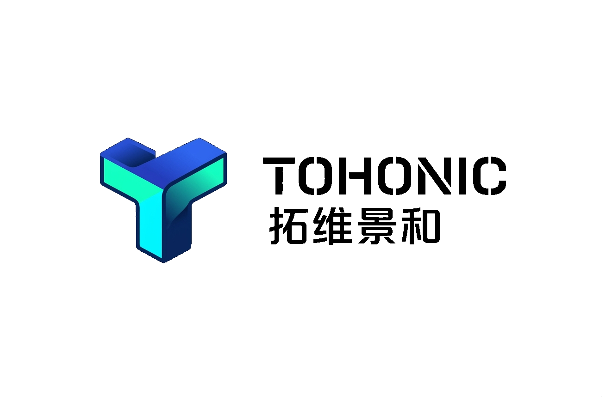

  <picture>
    <source media="(prefers-color-scheme: dark)" srcset="./src/logo_landscape_dark.png">
    <source media="(prefers-color-scheme: light)" srcset="./src/logo_landscape_light.png">
    
  </picture>

  <a href="./README.md">English</a> ｜ <b>简体中文</b>

---

## ✦ 我们的愿景

> **“推动全球数据科学发展，加速通用人工智能在物理世界的落地。”**

  

---

## ✦ 双中心协同架构

拓维景和采用**“成都算法中心”**与**“乐山超算中心”**的双向协同设计，深度整合四川绿色清洁能源与高端人才资源：

  

*   **成都算法中心 ｜ 智力中枢**
    坐落于成都天府软件园，专注于通用人工智能核心算法研发、多模态认知模型设计以及企业级基础软件架构开发。
*   **乐山超算中心 ｜ 动力底座**
    坐落于乐山绿色超算产业园，依托当地丰沛的水电清洁能源，建设高吞吐、低碳排的全球数据存储集群与超大规模异构算力网络，专门负责全球海量数据的采集、清洗与关联计算。

---

## ✦ 核心技术支柱

我们致力于在数据科学与通用人工智能的交叉领域，攻克真实物理世界中的复杂计算与感知难题：

  

### 1. 多维数据治理与开源数据集
持续研发高效、健壮的多维数据治理工具，提供覆盖全球物流、商业地理等多领域的高质量标准数据集，消除复杂数据清洗与对齐中的重复劳动。

### 2. 物理世界认知大模型
探索具备时空感知、因果逻辑推理与物理先验的智能体与认知大模型，使人工智能能够深刻理解并重塑复杂的物理实体与商业流转。

### 3. 绿色超算与低碳基础设施
极致优化分布式存储与异构计算效能，持续提升全球数据存储集群与算力底座的能效比，实现绿色低碳的可持续计算。

---

## ✦ 招贤纳士

在拓维景和，我们脚踏实地用代码 and 数据重塑物理世界。我们欢迎所有技术、产品、运营、管理或其他领域的专业人才，只要你具备以下特质，我们随时期待你的加入：

  

### 🌟 团队核心特质
*   **极限自驱与问题拆解**：在充满不确定性的前沿探索中，能够以高度的自主性拨开迷雾，主动拆解并独立解决核心痛点。
*   **专业深度与快速迭代**：在自身的专业领域拥有深厚积累，同时保持极强的好奇心与快速学习新知识、快速迭代的能力。
*   **坦诚沟通与目标共识**：崇尚理性与坦诚的沟通方式，能将复杂的逻辑极简化，以共同的目标为导向进行高效协同。

### ✉️ 申请方式
*   **招聘邮箱：** `hr@tohonic.com` （请注明：“姓名 - 期望方向 - 简历/个人链接”）
*   我们提供具有竞争力的薪酬福利、灵活开放的工作氛围以及与一流团队并肩作战的机会。

---

### 官方网站与联系方式

*   **官方网站：** [tohonic.com](https://tohonic.com)
*   **商务合作：** `contact@tohonic.com`
*   **人才招聘：** `hr@tohonic.com`
*   **双中心地址：** 
    *   *成都总部：* 中国 · 四川省成都市高新区天府软件园
    *   *乐山总部：* 中国 · 四川省乐山市绿色超算产业园
