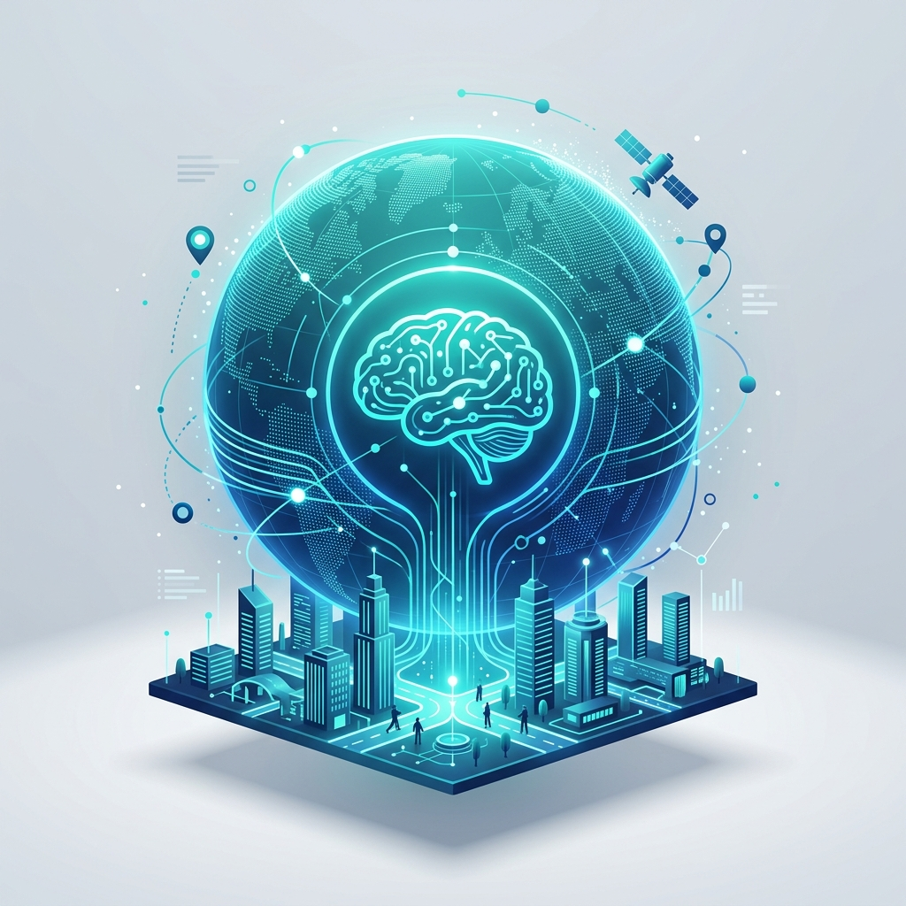
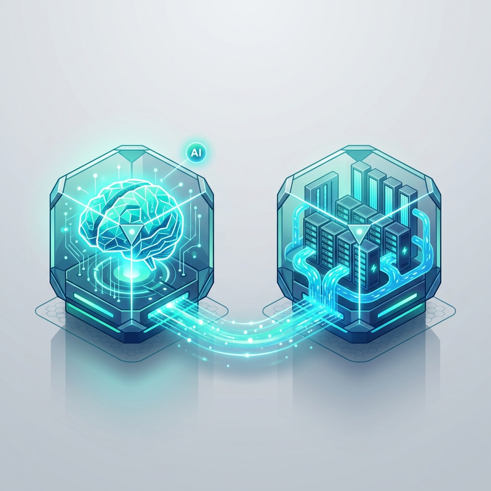
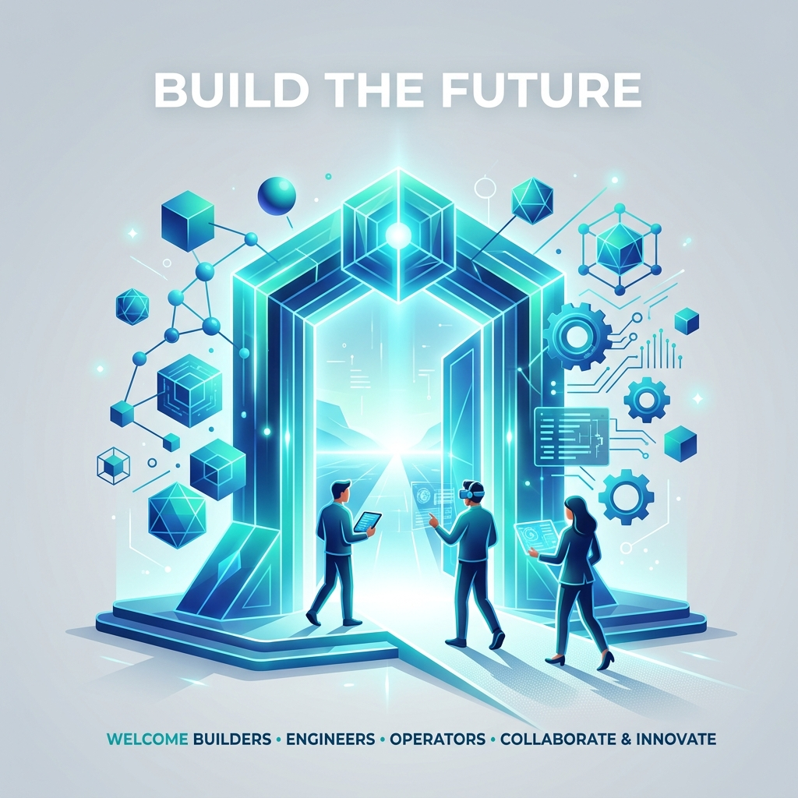

  <picture>
    <source media="(prefers-color-scheme: dark)" srcset="./src/logo_landscape_dark.png">
    <source media="(prefers-color-scheme: light)" srcset="./src/logo_landscape_light.png">
    
  </picture>

  <b>English</b> ｜ <a href="./README_ZH.md">简体中文</a>

---

## ✦ Our Vision

> **"To advance global data science and accelerate the deployment of Artificial General Intelligence in the physical world."**

  

---

## ✦ Dual-Center Collaborative Architecture

Tohonic operates under a dual-center design, strategically integrating Chengdu's high-tech talent pool with Leshan's abundant green energy assets:

  

*   **Chengdu Algorithm Center | Intelligence Hub**
    Located in Tianfu Software Park, Chengdu, focusing on core AGI algorithms, multimodal cognitive model training, and enterprise-grade software infrastructure.
*   **Leshan Supercomputing Center | Compute Base**
    Located in Green Supercomputing Industrial Park, Leshan, utilizing regional hydroelectric power to run high-throughput, low-carbon global data storage clusters and supercomputing grids for massive data ingestion, cleaning, and relation modeling.

---

## ✦ Core Technological Pillars

We stand at the intersection of data science and AGI, solving complex computational and cognitive challenges in the physical world:

  

### 1. Data Commons & Governance
We develop robust, high-performance tools for multidimensional data governance and publish high-quality benchmark datasets for logistics, geographical networks, and global supply chains to reduce redundant engineering efforts.

### 2. Physical Cognitive Models
We research next-generation cognitive models and agents equipped with spatial-temporal perception, causal reasoning, and physical priors to understand and reshape real-world physical and commercial operations.

### 3. Green Compute & Sustainable Infrastructure
We continuously optimize distributed storage and heterogeneous computation efficiency to build eco-friendly computing grids, minimizing the carbon footprint of massive-scale computing.

---

## ✦ Join the Team

At Tohonic, we skip the hype and focus on writing code and engineering data pipelines that matter. We welcome specialists in engineering, research, product, operations, and administration who share our core values:

  

### 🌟 What We Value
*   **High Agency & Problem Solving:** You thrive in ambiguity, take initiative, and proactively unpack and solve complex, open-ended challenges.
*   **Domain Excellence & Fast Learning:** You possess strong expertise in your field and have a relentless curiosity to learn new tools and cross-disciplinary domains.
*   **Clear Communication & Collaboration:** You simplify complex ideas, communicate effectively across roles, and coordinate smoothly with others to achieve shared goals.

### ✉️ How to Apply
*   **Careers Email:** `hr@tohonic.com` (Please use the subject: "Name - Areas of Interest - Resume/Profile link")
*   We offer competitive compensation, a highly flexible work environment, and a culture that values craftsmanship, ownership, and collaborative growth.

---

## ✦ Official Channels

*   **Official Website:** [tohonic.com](https://tohonic.com)
*   **Business Inquiry:** `contact@tohonic.com`
*   **Careers Contact:** `hr@tohonic.com`
*   **Chengdu Headquarters:** Tianfu Software Park, High-Tech Zone, Chengdu, Sichuan, China
*   **Leshan Headquarters:** Green Supercomputing Industrial Park, Leshan, Sichuan, China